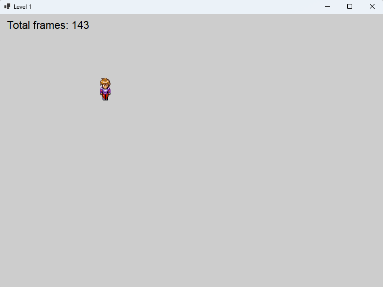

## Tutorial: Membuat Game Sederhana dengan Sprite Animasi di C#

### Tujuan
Mempelajari cara membuat game sederhana dengan animasi sprite yang berjalan menggunakan Windows Forms di C#. Dalam game ini, pemain dapat bergerak dalam 4 arah menggunakan animasi dari sprite sheet.



### Lingkungan Pengembangan
1. Platform: .NET 6.0
2. Bahasa: C# 10
3. IDE: Visual Studio 2022

### Langkah-langkah

### 1. Membuat Form Utama

Buat kelas `LevelForm` sebagai form utama game. Set ukuran, warna latar belakang, dan properti lainnya.

```csharp
using System.Drawing;
using System.Windows.Forms;

namespace SpriteAnimation
{
    public class LevelForm : Form
    {
        private const int PlayerInitialPositionX = 50;
        private const int PlayerInitialPositionY = 50;
        private const int AnimationInterval = 100;

        public LevelForm()
        {
            InitializeLevel();
        }

        private void InitializeLevel()
        {
            this.Text = "Level 1";
            this.Size = new Size(800, 600);
            this.BackColor = Color.LightGray;
        }
    }
}
```

### 2. Menjalankan Form Utama

Modifikasi kelas `Program` agar menjalankan `LevelForm` saat aplikasi dimulai. Jalankan aplikasi untuk mengetahui hasilnya dengan menekan tombol `F5`.

```csharp
using System;
using System.Windows.Forms;

namespace SpriteAnimation
{
    internal static class Program
    {
        [STAThread]
        static void Main()
        {
            ApplicationConfiguration.Initialize();
            Application.Run(new LevelForm());
        }
    }
}
```

### 3. Menambahkan Angka Jumlah Frame

Tambahkan label di `LevelForm` untuk menampilkan total frame yang telah dirender, yang akan diperbarui setiap kali frame baru ditampilkan. Kemudian jalankan aplikasi untuk melihat hasilnya.

```csharp
public class LevelForm : Form
{
    // ...kode sebelumnya...

    private Label _frameLabel;
    private long _totalFrameCount;

    private void InitializeLevel()
    {
        
        // ...kode sebelumnya...

        _frameLabel = new Label
        {
            Text = "Total frames: ",
            Location = new Point(10, 10),
            AutoSize = true,
            Font = new Font("Arial", 16),
            ForeColor = Color.Black
        };
        this.Controls.Add(_frameLabel);
    }

    private void UpdateFrameCount()
    {
        _totalFrameCount++;
        _frameLabel.Text = "Total frames: " + _totalFrameCount;
    }
}
```

### 4. Menambahkan Karakter Player

Buat kelas `Player` yang menggunakan `PictureBox` untuk menampilkan karakter pemain.

```csharp
using System.Drawing;
using System.Windows.Forms;

namespace SpriteAnimation
{
    public class Player
    {
        private PictureBox _playerPictureBox;

        public Player(Point startPosition)
        {
            _playerPictureBox = new PictureBox
            {
                Size = new Size(32, 48),
                Location = startPosition,
                BackColor = Color.Red
            };
        }

        public PictureBox GetPictureBox() => _playerPictureBox;
    }
}
```

### 5. Membuat Resource File untuk Animasi Sprite
1. Tambahkan file sprite sheet ke dalam proyek:
   - Klik kanan pada proyek > **Add > New Folder** dan beri nama folder tersebut `Resources`.
   - Tambahkan file sprite sheet ke dalam folder `Resources` (dalam tutorial ini file bernama `rpg_sprite_walk.png`).

2. Tambahkan resource ini ke proyek:
   - Klik kanan pada proyek > **Add > New Item > Resources File** dan beri nama `Resource`.
   - Klik pada `Resource.resx`. Pilih icon `+` untuk memunculkan window `Add a new resource`. Pilih Type `Image`. Klik tombol `Add Existing File` dan pilih file sprite sheet (`rpg_sprite_walk.png`). Pilih opsi Store as `System.Byte[]`.

Sekarang Anda bisa mengakses file ini sebagai `Resource.rpg_sprite_walk` di kode Anda.

### 6. Menampilkan Image Sprite Player di Kelas `Player`

Modifikasi kelas `Player` untuk memuat sprite sheet dari resource file dan menampilkan gambar pada `PictureBox`.

```csharp
using System.Drawing;
using System.IO;
using System.Windows.Forms;

namespace SpriteAnimation
{
    public class Player
    {
        private PictureBox _playerPictureBox;
        private Image _spriteSheet;

        public Player(Point startPosition)
        {
            using (MemoryStream ms = new MemoryStream(Resource.rpg_sprite_walk))
            {
                _spriteSheet = Image.FromStream(ms);
            }

            _playerPictureBox = new PictureBox
            {
                Size = new Size(32, 48),
                Location = startPosition,
                BackColor = Color.Transparent,
                Image = _spriteSheet,
                SizeMode = PictureBoxSizeMode.StretchImage
            };
        }

        public PictureBox GetPictureBox() => _playerPictureBox;
    }
}
```

### 7. Menampilkan Gambar Player Statis di `LevelForm`

Tambahkan instance `Player` ke `LevelForm` untuk menampilkan gambar statis pemain.

```csharp
public class LevelForm : Form
{
    // ...kode sebelumnya...

    private Player _player;

    private void InitializeLevel()
    {
        // ...kode sebelumnya...

        _player = new Player(new Point(PlayerInitialPositionX, PlayerInitialPositionY));
        this.Controls.Add(_player.GetPictureBox());
    }
}
```

### 8. Menambahkan Kemampuan Animasi Berjalan dan Berhenti di Kelas `Player`

Modifikasi kelas `Player` untuk menambahkan animasi berjalan berdasarkan arah yang ditekan dan berhenti saat tombol dilepaskan. Jalankan aplikasi untuk melihat hasilnya.

```csharp
using System.Drawing;
using System.IO;
using System.Windows.Forms;

namespace SpriteAnimation
{
    public class Player
    {
        private const int PlayerWidth = 32;
        private const int PlayerHeight = 48;
        private const int TotalFrames = 8;

        private PictureBox _playerPictureBox;
        private Image _spriteSheet;
        private int _currentFrame;
        private int _currentRow;
        private bool _isMoving;

        public Player(Point startPosition)
        {
            using (MemoryStream ms = new MemoryStream(Resource.rpg_sprite_walk))
            {
                _spriteSheet = Image.FromStream(ms);
            }

            _currentFrame = 0;
            _currentRow = 0;

            _playerPictureBox = new PictureBox
            {
                Size = new Size(PlayerWidth, PlayerHeight),
                Location = startPosition,
                BackColor = Color.Transparent
            };

            UpdateSprite();
        }

        public PictureBox GetPictureBox() => _playerPictureBox;

        public void Walk(Keys key, Size boundary)
        {
            int speed = 10;
            _isMoving = true;

            switch (key)
            {
                case Keys.Down:
                    _currentRow = 0;
                    if (_playerPictureBox.Bottom < boundary.Height)
                        _playerPictureBox.Top += speed;
                    break;
                case Keys.Up:
                    _currentRow = 1;
                    if (_playerPictureBox.Top > 0)
                        _playerPictureBox.Top -= speed;
                    break;
                case Keys.Left:
                    _currentRow = 2;
                    if (_playerPictureBox.Left > 0)
                        _playerPictureBox.Left -= speed;
                    break;
                case Keys.Right:
                    _currentRow = 3;
                    if (_playerPictureBox.Right < boundary.Width)
                        _playerPictureBox.Left += speed;
                    break;
                default:
                    _isMoving = false;
                    break;
            }
        }

        public void StopWalking()
        {
            _isMoving = false;
            _currentFrame = 0;
            UpdateSprite();
        }

        public void Animate()
        {
            if (_isMoving)
            {
                _currentFrame = (_currentFrame + 1) % TotalFrames;
                UpdateSprite();
            }
        }

        private void UpdateSprite()
        {
            int frameWidth = _spriteSheet.Width / TotalFrames;
            int frameHeight = _spriteSheet.Height / 4;

            Rectangle srcRect = new Rectangle(_currentFrame * frameWidth, _currentRow * frameHeight, frameWidth, frameHeight);
            Bitmap currentFrameImage = new Bitmap(frameWidth, frameHeight);

            using (Graphics g = Graphics.FromImage(currentFrameImage))
            {
                g.DrawImage(_spriteSheet, new Rectangle(0, 0, frameWidth, frameHeight), srcRect, GraphicsUnit.Pixel);
            }

            _playerPictureBox.Image = currentFrameImage;
        }
    }
}
```

### 9. Menambahkan Animation Timer

Tambahkan `Timer` di `LevelForm` untuk memanggil metode `Render` setiap interval, guna memperbarui animasi.

```csharp
public class LevelForm : Form
{
    // ...kode sebelumnya... 
    private System.Windows.Forms.Timer _animationTimer;

    private void InitializeLevel()
    {
        // ...kode sebelumnya... 

        _animationTimer = new System.Windows.Forms.Timer { Interval = AnimationInterval };
        _animationTimer.Tick += (sender, e) => Render();
        _animationTimer.Start();
    }

    private void Render()
    {
        UpdateFrameCount();
        _player.Animate();
    }
}
```

### 10. Menambahkan Event Handling `KeyDown` dan `KeyUp`

Tambahkan event handler di `LevelForm` untuk menangani input dari keyboard.

```csharp
public class LevelForm : Form
{
    // ...kode sebelumnya... 

    private void InitializeLevel()
    {
        // ...kode sebelumnya... 

        this.KeyDown += OnKeyDown;
        this.KeyUp += OnKeyUp;
    }

    private void OnKeyDown(object sender, KeyEventArgs e)
    {
        _player.Walk(e.KeyCode, this.ClientSize);
    }

    private void OnKeyUp(object sender, KeyEventArgs e)
    {
        _player.StopWalking();
    }
}
```

### 11. Menjalankan dan Menguji Coba Aplikasi Permainan

1. Jalankan aplikasi.
2. Gunakan tombol panah untuk menggerakkan pemain ke atas, bawah, kiri, dan kanan.
3. Amati animasi berjalan saat pemain bergerak dan berhenti saat tombol dilepaskan.